# 恒星光谱深度学习分析框架

<div align="center">


**一个专为恒星光谱分析设计的深度学习框架，专注于CEMP星识别和恒星大气参数预测**

</div>

## 📋 目录

- [项目简介](#项目简介)
- [主要特性](#主要特性)
- [快速开始](#快速开始)
- [模型架构](#模型架构)
- [数据格式](#数据格式)
- [使用指南](#使用指南)
- [模型融合](#模型融合)
- [配置系统](#配置系统)
- [评估指标](#评估指标)
- [项目结构](#项目结构)
- [高级功能](#高级功能)
- [学术背景](#学术背景)

## 🌟 项目简介

本项目是一个基于深度学习的恒星光谱分析框架，专门用于：

- **CEMP星识别**: 识别碳增强贫金属星（Carbon Enhanced Metal Poor stars）
- **恒星大气参数回归**: 预测金属丰度、有效温度、表面重力等参数
- **多任务学习**: 同时进行分类和回归任务
- **模型融合**: 集成多个模型以提高预测性能

### 研究成果

本项目基于LAMOST DR8数据集，实现了：
- **MP星搜寻**: Recall=0.9592, Precision=0.9493, F1=0.9542
- **CEMP星搜寻**: Recall=0.6428, Precision=0.7826, F1=0.7058
- **参数估计**: Teff MAE=74.9K, logg MAE=0.1749, [Fe/H] MAE=0.0889
- **大规模应用**: 发现819,671颗贫金属星候选体，12,766颗富碳贫金属星候选体

## ✨ 主要特性

### 🏗️ 多种神经网络架构
- **MPBDNet**: 多分支双向卷积网络，专为光谱分析设计
- **BGANet**: 基于注意力机制的双向GRU网络
- **StarNet**: 经典的天体物理光谱分析网络
- **RRNet**: 残差网络，支持多种模式（raw/pre-RNN/post-RNN）

### 🎯 灵活的任务配置
- **分类任务** (`cls`): CEMP星三分类（MP/CEMP/NMP）
- **回归任务** (`reg`): 五个恒星大气参数预测
- **联合任务** (`cls_reg`): 同时进行分类和回归

### 🔧 强大的工具集
- **智能训练**: 自动学习率调度、早停机制
- **模型融合**: 加权平均集成多个模型
- **特征分析**: 光谱特征重要性分析
- **数据可视化**: 数据预处理可视化工具

### 📊 专业评估
- **CEMP星专门指标**: 针对正样本的precision/recall/F1
- **多级别评估**: 单类别和整体加权平均指标
- **回归指标**: MAE等专业天体物理评估指标

## 🚀 快速开始

### 环境要求

```bash
Python >= 3.8
PyTorch >= 1.8
NumPy >= 1.19
Pandas >= 1.3
Scikit-learn >= 0.24
PyYAML >= 5.4
```

### 安装环境

```bash
# 创建conda环境（推荐）
conda create -n stellar_analysis python=3.8 pytorch==2.0.0 cudatoolkit=11.8 -c pytorch
conda activate stellar_analysis

# 安装依赖
pip install numpy pandas scikit-learn pyyaml tqdm matplotlib seaborn
```

### 数据准备

将您的数据按以下结构组织：

```
data/
├── train/
│   ├── X_train.npy    # 训练光谱数据 [N, spectrum_length]
│   └── y_train.csv    # 训练标签
├── val/
│   ├── X_val.npy      # 验证光谱数据
│   └── y_val.csv      # 验证标签
└── spectra/           # 原始光谱文件（可选）
```

### 基础使用

```bash
# 训练CEMP星分类模型
python train.py --config=./config/MPBD_cls.yaml

# 训练恒星参数回归模型
python train.py --config=./config/MPBD_reg.yaml

# 验证模型性能
python val.py --config=./config/MPBD_cls.yaml

# 模型融合
python ensemble.py --config=./config/ensemble_cls.yaml
```

## 🏛️ 模型架构

### 整体框架概览

```mermaid
graph TB
    A[输入光谱数据] --> B[数据预处理]
    B --> C[模型选择]
    C --> D1[MPBDNet]
    C --> D2[BGANet]
    C --> D3[StarNet]
    C --> D4[RRNet]
    D1 --> E[特征提取]
    D2 --> E
    D3 --> E
    D4 --> E
    E --> F[任务头]
    F --> G1[分类输出]
    F --> G2[回归输出]
    F --> G3[联合输出]
    G1 --> H[模型融合]
    G2 --> H
    G3 --> H
    H --> I[最终预测]
```



### MPBDNet - 多分支双向网络


**架构特点:**
- **多尺度特征提取**: 3×3和5×7卷积捕获不同频率特征
- **双向序列建模**: LSTM处理光谱的全局依赖关系
- **注意力机制**: 聚焦重要的光谱区域
- **优势**: 适合光谱数据的频率特性，高精度分类和回归


## 📊 数据格式

### 光谱数据
- **格式**: NumPy数组 (.npy)
- **形状**: `[样本数, 光谱长度]`
- **范围**: 通常已归一化到 [0, 1] 或标准化

### 标签数据
- **格式**: CSV文件
- **回归标签**: `["FeH", "CH", "Teff", "logg", "CFe"]`
  - FeH: 铁丰度 [Fe/H]
  - CH: 碳丰度 [C/H]
  - Teff: 有效温度 (K)
  - logg: 表面重力 log(g)
  - CFe: 碳铁比 [C/Fe]
- **分类标签**: `['f_CEMP']`
  - 0: MP (Metal Poor) - 贫金属星
  - 1: CEMP (Carbon Enhanced Metal Poor) - 碳增强贫金属星
  - 2: NMP (Non Metal Poor) - 非贫金属星

## 📖 使用指南

### 训练模型

```bash
# 基础训练
python train.py --config=config/模型_任务.yaml

# 指定GPU
CUDA_VISIBLE_DEVICES=0 python train.py --config=config/BGANet_cls.yaml

# 从检查点恢复
python train.py --config=config/MPBD_reg.yaml
```

### 验证和测试

```bash
# 验证单个模型
python val.py --config=config/StarNet_cls.yaml

# 在全部数据上评估
python val.py --config=config/RRNet_reg.yaml
```

### 特征重要性分析

```bash
# 分析光谱特征重要性
python feature_importance_analysis.py --config=config/MPBD_cls.yaml --num_noise_block=10
```

### 数据可视化

```bash
# 数据预处理可视化
python tools/vision_data_prepocess.py
```

### 数据增强

框架支持多种光谱数据增强方法，通过配置文件灵活控制，提高模型的泛化能力和鲁棒性。

#### 增强方法概览

```mermaid
graph TB
    A[原始光谱] --> B{增强概率}
    B -->|p| C[选择增强方法]
    B -->|1-p| D[保持原样]
    
    C --> E1[高斯噪声]
    C --> E2[光谱缩放]
    C --> E3[基线漂移]
    C --> E4[波长偏移]
    C --> E5[光谱平滑]
    C --> E6[光谱Dropout]
    
    E1 --> F[增强后光谱]
    E2 --> F
    E3 --> F
    E4 --> F
    E5 --> F
    E6 --> F
    D --> F
    
    style A fill:#e1f5fe
    style F fill:#c8e6c9
    style C fill:#f3e5f5
```



#### 增强效果可视化

```mermaid
graph LR
    A[原始光谱<br/>连续平滑] --> B[高斯噪声<br/>+随机扰动]
    A --> C[光谱缩放<br/>+幅度变化]
    A --> D[基线漂移<br/>+趋势变化]
    A --> E[波长偏移<br/>+相位变化]
    
    subgraph "增强目标"
        F[提高泛化能力]
        G[增强鲁棒性]
        H[模拟真实噪声]
    end
    
    style A fill:#e1f5fe
    style B fill:#fff3e0
    style C fill:#fff3e0
    style D fill:#fff3e0
    style E fill:#fff3e0
```



#### 使用方法

```bash
# 使用数据增强训练
python train.py --config=config/MPBD_cls_with_augmentation.yaml

# 测试数据增强功能
python test_augmentation.py
```

#### 支持的增强方法

| 方法 | 描述 | 参数 | 效果 |
|------|------|------|------|
| **高斯噪声** | 添加随机高斯噪声 | `std`: 噪声标准差 | 模拟仪器噪声 |
| **光谱缩放** | 随机缩放光谱幅度 | `range`: 缩放范围 | 模拟仪器响应差异 |
| **基线漂移** | 添加线性基线漂移 | `slope_range`: 斜率范围 | 模拟观测条件变化 |
| **波长偏移** | 随机偏移波长轴 | `shift_range`: 偏移范围 | 模拟光谱校准误差 |
| **光谱平滑** | 高斯滤波平滑 | `sigma`: 平滑参数 | 模拟不同分辨率 |
| **光谱Dropout** | 随机遮挡波段 | `dropout_rate`: 遮挡比例 | 模拟部分波段缺失 |

#### 配置示例

```yaml
# 在配置文件中添加数据增强
data_augmentation:
  probability: 0.6  # 60%的样本会被增强
  methods:
    gaussian_noise:
      enabled: True
      probability: 0.4
      std: 0.008
    spectral_scaling:
      enabled: True  
      probability: 0.3
      range: 0.08
    baseline_drift:
      enabled: True
      probability: 0.2
      slope_range: 0.001
    wavelength_shift:
      enabled: True
      probability: 0.2
      shift_range: 2
    spectral_smoothing:
      enabled: True
      probability: 0.1
      sigma: 1.0
    spectral_dropout:
      enabled: True
      probability: 0.1
      dropout_rate: 0.05
```

## 🔄 模型融合

模型融合通过集成多个模型来提高预测性能，特别适合提升CEMP星识别的准确性。

### 融合架构图

```mermaid
graph TB
    A[输入光谱] --> B1[model1]
    A --> B2[model2]
    A --> B3[model3]
    A --> B4[model4]
    
    B1 --> C1[预测1]
    B2 --> C2[预测2]
    B3 --> C3[预测3]
    B4 --> C4[预测4]
    
    C1 --> D[权重分配]
    C2 --> D
    C3 --> D
    C4 --> D
    
    D --> E[加权平均]
    E --> F[最终预测]
    
    subgraph "权重计算"
        G[模型性能评估]
        H[权重归一化]
        I[动态调整]
    end
    
    G --> H
    H --> I
    I --> D
    
    style A fill:#e1f5fe
    style F fill:#c8e6c9
    style D fill:#f3e5f5
```



### 融合流程

```mermaid
sequenceDiagram
    participant U as 用户
    participant E as 融合引擎
    participant M1 as MPBDNet
    participant M2 as BGANet
    participant M3 as StarNet
    participant W as 权重计算器
    
    U->>E: 加载融合配置
    E->>M1: 加载模型权重
    E->>M2: 加载模型权重
    E->>M3: 加载模型权重
    
    U->>E: 输入光谱数据
    E->>M1: 前向传播
    E->>M2: 前向传播
    E->>M3: 前向传播
    
    M1-->>E: 预测结果1
    M2-->>E: 预测结果2
    M3-->>E: 预测结果3
    
    E->>W: 计算融合权重
    W-->>E: 归一化权重
    E->>E: 加权平均
    E-->>U: 最终预测结果
```



### 基本用法

```bash
# 分类任务融合
python ensemble.py --config=config/ensemble_cls.yaml

# 回归任务融合  
python ensemble.py --config=config/ensemble_reg.yaml

# 联合任务融合
python ensemble.py --config=config/ensemble_cls_reg.yaml

# 保存预测结果
python ensemble.py --config=config/ensemble_cls.yaml --save_predictions --output_dir=./results
```

### 配置示例

```yaml
# 融合配置文件
object_type: 'cls'
data_dir: "data/"

models:
  - name: 'MPBDNet'
    path: 'model_save/MPBD_cls/best.pth'
    weight: 1.2  # 性能最好，权重最高
    
  - name: 'BGANet'
    path: 'model_save/BGANet_cls/best.pth'
    weight: 1.0
    
  - name: 'StarNet'
    path: 'model_save/StarNet_cls/best.pth'
    weight: 0.8  # 基准模型，权重较低
```

### 融合策略

| 策略 | 描述 | 优势 | 适用场景 |
|------|------|------|----------|
| **加权平均** | 根据模型性能分配权重 | 简单有效，计算快速 | 模型性能差异明显 |
| **自动归一化** | 权重自动标准化到[0,1] | 避免权重过大或过小 | 权重差异较大时 |
| **动态调整** | 根据验证集性能调整权重 | 自适应优化 | 数据分布变化时 |
| **投票机制** | 多数投票决定最终结果 | 鲁棒性强 | 分类任务 |


## ⚙️ 配置系统

### 配置文件结构

```yaml
# 基本配置
object_type: 'cls'          # 任务类型: 'cls', 'reg', 'cls_reg'
data_dir: "data/"           # 数据目录
object_name: 'MPBD_cls'     # 实验名称

# 数据配置
reg_columns: ["FeH", "CH", "Teff", "logg", "CFe"]
cls_columns: ['f_CEMP']
cls_dict: {0: 'MP', 1: 'CEMP', 2: 'NMP'}

# 标准化参数
y_mean: [-8.81020067e-01, -9.78005818e-01, 4.91095684e+03, 2.55795385e+00, -9.69857512e-02]
y_std: [7.61077821e-01, 8.42965361e-01, 4.97515564e+02, 1.15882902e+00, 3.06636238e-01]

# 模型配置
model:
  name: 'MPBDNet'
  list_inplanes: [20,40,80,160]
  len_spectrum: 4900

# 训练配置
lr: 0.0001
num_epochs: 200

# 损失函数
loss:
  cls_loss:
    loss_name: 'CrossEntropyLoss'
    rate: 1.0

# 学习率调度
scheduler:
  name: 'StepLR'
  step_size: 30
  gamma: 0.75

# 模型保存
resume_from: 'model_save/MPBD_cls/best.pth'
```

### 可用配置文件

- **分类任务**: `*_cls.yaml`
- **回归任务**: `*_reg.yaml`  
- **联合任务**: `*_cls_reg.yaml`
- **融合配置**: `ensemble_*.yaml`

## 📁 项目结构


### 详细文件结构

```
thesis/
├── config/                     # 配置文件目录
│   ├── MPBD_cls.yaml          # MPBD分类配置
│   ├── MPBD_reg.yaml          # MPBD回归配置
│   ├── MPBD_reg_cls.yaml      # MPBD联合任务配置
│   ├── BGANet_cls.yaml        # BGANet分类配置
│   ├── BGANet_reg.yaml        # BGANet回归配置
│   ├── BGANet_cls_reg.yaml    # BGANet联合任务配置
│   ├── StarNet_cls.yaml       # StarNet分类配置
│   ├── RRNet_cls.yaml         # RRNet分类配置
│   ├── RRNet_reg.yaml         # RRNet回归配置
│   └── ensemble_*.yaml        # 模型融合配置
├── data/                       # 数据目录
│   ├── train/                 # 训练数据
│   │   ├── X_train.npy        # 训练光谱数据
│   │   └── y_train.csv        # 训练标签
│   ├── val/                   # 验证数据
│   │   ├── X_val.npy          # 验证光谱数据
│   │   └── y_val.csv          # 验证标签
│   └── spectra/               # 原始光谱文件
├── models/                     # 模型定义
│   ├── __init__.py
│   ├── MPBDNet.py             # MPBD网络
│   ├── BGANet.py              # BGAN网络
│   ├── StarNet.py             # StarNet网络
│   ├── RRNet.py               # RRNet网络
│   ├── create/                # 模型创建工具
│   │   ├── create_loss.py     # 损失函数创建
│   │   └── create_scheduler.py # 调度器创建
│   └── loss/                  # 损失函数
│       ├── __init__.py
│       ├── focal.py           # Focal Loss
│       └── gaussian_nll.py    # 高斯负对数似然
├── model_save/                 # 模型保存目录
│   ├── MPBD_cls/              # MPBD分类模型
│   ├── MPBD_reg/              # MPBD回归模型
│   ├── MPBD_reg_cls/          # MPBD联合任务模型
│   ├── BGANet_cls/            # BGANet分类模型
│   ├── BGANet_reg/            # BGANet回归模型
│   ├── BGANet_cls_reg/        # BGANet联合任务模型
│   ├── StarNet_cls/           # StarNet分类模型
│   ├── RRNet_cls/             # RRNet分类模型
│   └── RRNet_reg/             # RRNet回归模型
├── out_csv/                    # 输出结果
│   ├── BGANet_cls/            # BGANet分类结果
│   ├── MPBD_cls/              # MPBD分类结果
│   └── MPBD_reg/              # MPBD回归结果
├── tools/                      # 工具脚本
│   └── vision_data_prepocess.py # 数据预处理可视化
├── utils/                      # 工具函数
│   ├── __init__.py
│   ├── tools.py               # 通用工具函数
│   └── pylamost/              # LAMOST数据处理
├── fig/                        # 图表输出
│   ├── data_preprocessing/     # 数据预处理图表
│   └── MPBD_reg/              # MPBD回归结果图表
├── ppt/                        # 演示文稿
├── train.py                    # 训练脚本
├── val.py                      # 验证脚本
├── ensemble.py                 # 模型融合脚本
├── feature_importance_analysis.py # 特征重要性分析
└── README.md                   # 项目说明
```

## 🔬 高级功能

### 1. 自适应损失函数
- **Focal Loss**: 处理类别不平衡
- **Gaussian NLL**: 不确定性量化
- **加权损失**: 自定义类别权重

### 2. 学习率调度
- **StepLR**: 阶梯式衰减
- **CosineAnnealingLR**: 余弦退火
- **ReduceLROnPlateau**: 自适应调整

### 3. 特征重要性分析
```bash
python feature_importance_analysis.py \
    --config=config/MPBD_cls.yaml \
    --num_noise_block=10
```

### 4. 模型解释性
- 注意力权重可视化（BGANet）
- 特征敏感性分析
- 光谱区域重要性评估

### 5. 生产部署
- 模型权重保存/加载
- 预测结果导出
- 批量推理支持

### 6. 光谱数据增强
```bash
# 数据增强配置示例
data_augmentation:
  probability: 0.6  # 整体增强概率
  methods:
    gaussian_noise:     # 高斯噪声
      enabled: True
      probability: 0.4
      std: 0.008
    spectral_scaling:   # 光谱缩放
      enabled: True
      probability: 0.3
      range: 0.08
    baseline_drift:     # 基线漂移
      enabled: True
      probability: 0.35
      strength: 0.015
    wavelength_shift:   # 波长偏移
      enabled: True
      probability: 0.25
      max_shift: 3
```

**增强方法说明**：
- **适用场景**: 小样本学习、提高模型泛化性
- **物理意义**: 模拟真实观测中的各种误差和变化
- **配置灵活**: 每种方法可独立启用/禁用和调参
- **训练专用**: 仅在训练时应用，验证时不使用

## 🎯 最佳实践

### 训练建议
1. **数据预处理**: 确保光谱数据已正确归一化
2. **超参数调优**: 先用小学习率找到收敛范围
3. **早停机制**: 监控验证损失避免过拟合
4. **模型选择**: MPBD和BGANet通常表现最佳
5. **数据增强**: 
   - 小样本数据集建议使用轻量级增强
   - 大样本数据集可使用更激进的增强策略
   - 先不用增强建立基线，再逐步添加增强方法

### 融合策略
1. **模型多样性**: 选择不同架构的模型融合
2. **权重调优**: 根据验证集性能调整权重
3. **结果分析**: 关注CEMP星的专门指标

### 性能优化
1. **批量大小**: 根据GPU内存调整
2. **混合精度**: 使用FP16加速训练
3. **数据并行**: 多GPU训练大型模型

## 📚 学术背景

### LAMOST与CEMP星研究

大天区面积多目标光纤光谱望远镜 (LAMOST) 是我国自主研发的大型光学观测设备，为天文学研究提供了关键的数据支持。贫金属(Metal-Poor, MP)星是一类稀有而古老的恒星，而碳增强贫金属(Carbon-Enhanced Metal-Poor, CEMP)星则是其中的重要子类，显示出相对于铁元素的碳富集效应。

CEMP星被认为是由大爆炸后第一代恒星污染的气体形成的，是研究早期宇宙、星系演化和核合成的重要对象。本项目针对MP及CEMP样本的稀缺性问题，设计了深度学习方法来提高这两类样本的检出率和参数估计精度。

### 数据集构建

本工作使用LAMOST DR8数据集：
- **非贫金属星样本**: 4,723个
- **贫金属星样本**: 5,032个（包含167个CEMP星）
- **标签来源**: APOGEE DR17、LAMOST-Subaru、SAGA数据库
- **预处理**: 统一波段插值、连续谱拟合、归一化

### 核心贡献

1. **多尺度特征学习**: 提出MSFL-IECW网络，使用多尺度卷积和跨波段LSTM
2. **分类约束回归**: 基于分类约束的回归方法，避免参数估计的物理矛盾
3. **大规模应用**: 在LAMOST DR8上发现大量MP和CEMP星候选体
4. **未来展望**: 可应用于CSST等大型空间天文设施

## 📞 联系方式

- **作者**: Ziyu Fang
- **邮箱**: fangziyushiwo@126.com
- **日期**: 2024-12-25

### 引用格式
```bibtex
@article{fang2025catalog,
  title={A Catalog of 12,766 Carbon-enhanced Metal-poor Stars from LAMOST Data Release 8},
  author={Fang, Ziyu and Li, Xiangru and Li, Haining},
  journal={The Astrophysical Journal Supplement Series},
  volume={277},
  number={1},
  pages={30},
  year={2025},
  publisher={IOP Publishing}
}
```

---

<div align="center">

**🌟 如果这个项目对您的研究有帮助，请给个Star！**

*专为天体物理学家和数据科学家设计的恒星光谱分析工具*

</div>


```bash
# 使用预定义的配置文件进行模型融合
python ensemble.py --config=./config/ensemble_cls.yaml

# 保存预测结果到指定目录
python ensemble.py --config=./config/ensemble_cls.yaml --save_predictions --output_dir=./results

```

### 配置文件说明

**分类任务融合**:
```bash
python ensemble.py --config=./config/ensemble_cls.yaml
```

**回归任务融合**:
```bash
python ensemble.py --config=./config/ensemble_reg.yaml
```

**分类+回归联合任务融合**:
```bash
python ensemble.py --config=./config/ensemble_cls_reg.yaml
```

**简单等权重融合**:
```bash
python ensemble.py --config=./config/ensemble_simple.yaml
```

### 配置文件格式

```yaml
# 基本任务配置
object_type: 'cls'  # 'cls', 'reg', 'cls_reg'
data_dir: "路径/到/数据目录"

# 融合模型列表
models:
  - name: 'StarNet'
    path: '模型权重文件路径'
    weight: 1.0  # 模型权重，数值越大影响越大
    len_spectrum: 4900
    
  - name: 'RRNet'
    path: '模型权重文件路径'
    weight: 1.2  # 给表现更好的模型更高权重
    list_inplanes: [20,40,80,160]
    len_spectrum: 3834
    mode: 'post-RNN'
```

### 输出结果

融合后会输出：
- **集成模型准确率**: 整体预测准确性
- **CEMP星专门指标**: 针对CEMP星的precision、recall、F1
- **整体加权平均指标**: 考虑类别平衡的整体性能
- **MAE**: 回归任务的平均绝对误差

### 高级功能

1. **自定义权重**: 可以根据单个模型性能调整权重
2. **自动归一化**: 权重会自动归一化，确保总和为1
3. **结果保存**: 可以保存集成预测结果用于进一步分析
4. **灵活配置**: 支持不同模型架构的任意组合